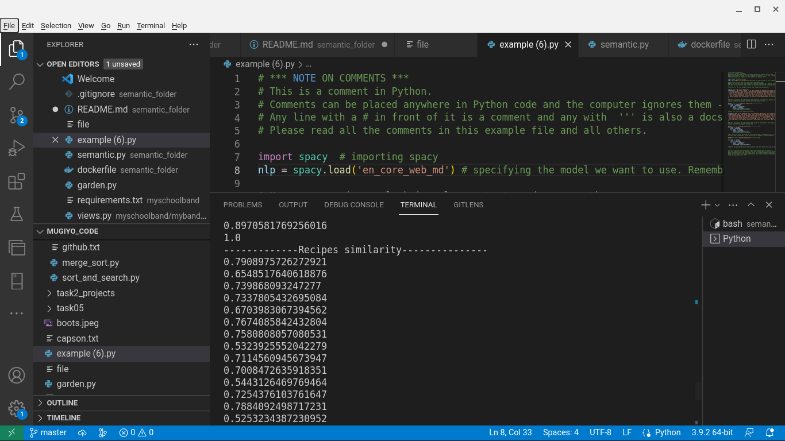
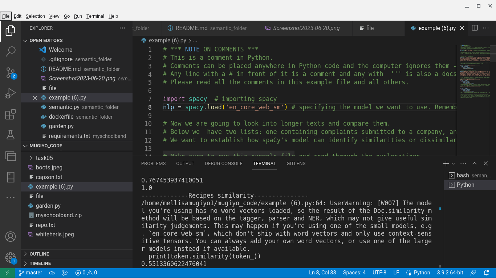

# sematicrepo

    
introuduction

***

Welcome to semantic.py
---
---
The file named semantic.py contains code about similarities of objects 
using models and spacy

-----------------
-----------------
about semantic,py
----------
***
Inside this file , monkey, banana and cat were compared .Cat and monkey seem to be very similar because they are both animals,it was also really interesting how monkey and banana had a higher similarity  because monkeys eat banana,Another interesting fact is that banana does not have any significant similarity with cat So ,the model does not explicitly seem to recognise transitive relationships in its calculation 
***
another really interesting fact was when the same code was ran but using different models. when I ran the code found in the file example using the model en_core_web_sm,I noticed that this model is very small, and did not respond to some of the simmilarity , I even got a warming saying:,
UserWarning: [W007] The model you are using has no word vectors loaded, so the result of the Doc.,similarity method will be based on the tagger, parser and NER, which may not give useful similarity judgements.
This may happen if you are using one of the small models, e.g`en_core_web_sm`, which does not ship with word vectors,and only use context-sensitive tensors. You can always add your own word vectors, or use one of the larger models instead if available.but when I used the model en_core_web_md, everything ran perfectly and it gave usefullsimillarities because this model is more advanced,
and it has word vectors loaded.
***

The file display
-------------

-----------------

How to view this file
------------
*first you need to dowload this file on your local machine
* you can then view it by clicking it 
* note that you can view it anywhere e.g using your phone or laptop 

